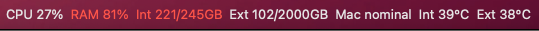
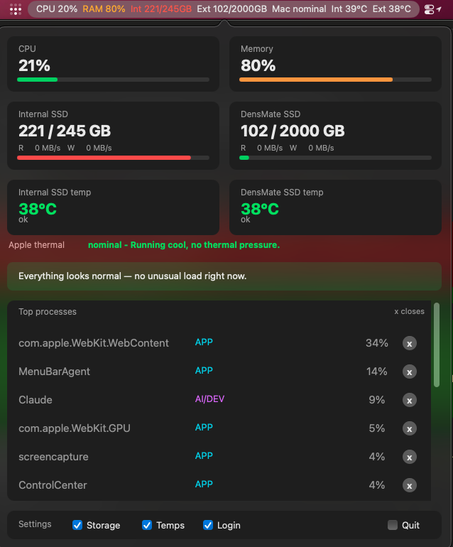
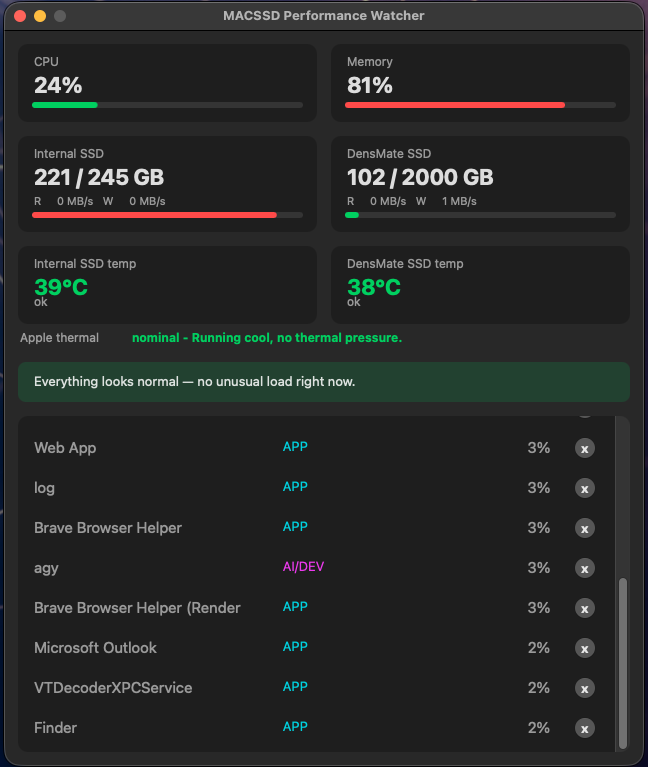

# MACSSD Performance Watcher

A native macOS menu bar app that watches CPU, RAM, and disk health across two drives (an internal SSD and an external NVMe enclosure), explains problems in plain English, and can act on them safely — with an hourly Telegram heartbeat that keeps working even when the app itself is closed.

Built for a Mac mini running always-on AI/dev tooling, where a runaway process or an overheating external drive needs to be caught before it becomes a hardware problem.

## Screenshots

**Menu bar — colour-coded at a glance, blinks on a critical reading:**



**Dashboard — click the menu bar icon to open it as a popover:**



**Standalone window mode (for local development/debugging):**



## Features

- **Live system monitoring** — CPU, RAM, and per-drive capacity/throughput, refreshed every few seconds.
- **Dual-drive hardware health** — SMART status and temperature for both drives via `smartctl`, plus Apple's own thermal-pressure signal (`NSProcessInfo.thermalState`) for the Mac as a whole.
- **Plain-English insights** — a rule-based engine (no LLM at runtime) that explains *why* something looks off, not just the raw numbers.
- **Safety-tiered process control** — click a process in the dashboard to close it, gated by a tier system:
  | Tier | Meaning | Behaviour |
  |---|---|---|
  | 🟢 Green | safe, reversible action (e.g. lowering a process's priority) | can run automatically |
  | 🟡 Yellow | closing a normal app | always asks for confirmation first, with an impact preview |
  | 🔴 Red | a system process, or the app's own process | refused, no override |

  Every action re-verifies the process's start time immediately before acting, so a reused PID from an unrelated, newer process is never mistaken for the one that was actually flagged.
- **Hourly Telegram heartbeat, independent of the app** — a `launchd`-scheduled background script (`macssd/watcher.py`) sends an hourly status update as a rendered dashboard-style image, runs whether the menu bar app is open or not, and only needs the Mac to be powered on and logged in (a locked screen doesn't stop it).
- **Automatic throttling on critical load** — if CPU, RAM, or drive usage crosses a critical threshold, the watcher automatically lowers the top CPU consumer's scheduling priority (non-destructive, fully reversible) and reports what it did.
- **Emergency shutdown escalation** — if a drive hits a critical temperature, it sends a warning, waits 5 minutes for a reply, and shuts the Mac down automatically if none arrives (opt-in: requires a scoped passwordless-sudo rule for exactly this command; disabled by default until configured).

## Architecture

```
macssd/
  collectors/     raw metrics: psutil, smartctl (drive health), NSProcessInfo (thermal state)
  severity.py     shared ok/warn/critical thresholds — used by both the live UI and the watcher
  actions.py      safety-tiered process actions (throttle, close) with stale-PID protection
  insights.py     rule-based plain-English explanation engine
  storage.py      shared drive-capacity + login-item helpers
  telegram.py     Telegram Bot API client (stdlib only, no extra dependency)
  dashboard_image.py  renders the hourly heartbeat as a dashboard-style PNG
  gui.py          native AppKit dashboard (PyObjC) — popover, standalone window, and process actions
  menubar.py      menu bar app (rumps) — status item, click-to-toggle popover
  watcher.py      one-shot hourly check, meant to be run by a launchd LaunchAgent
  app.py          the original Textual-based terminal dashboard
```

The UI never talks to the OS directly — it goes through the same collectors/severity/actions modules the background watcher uses, so the two never disagree about what counts as a problem.

## Requirements

- macOS (uses AppKit/PyObjC, NSProcessInfo, and `smartctl` from [smartmontools](https://www.smartmontools.org/))
- Python 3.13+
- A Telegram bot token, if you want the hourly heartbeat (see Configuration below)

## Setup

```bash
git clone <this-repo>
cd mac-system-intelligence-monitor
python3 -m venv .venv
./.venv/bin/pip install -r requirements.txt
brew install smartmontools   # for drive health/temperature
```

### Run the menu bar app

```bash
./.venv/bin/python -m macssd.menubar
```

### Run the original terminal dashboard

```bash
./.venv/bin/python -m macssd.app
```

### Configuration (Telegram, optional)

The hourly heartbeat and process alerts are optional. To enable them, create an env file with your own bot token and chat ID:

```bash
mkdir -p ~/.claude/channels/telegram
cat > ~/.claude/channels/telegram/.env << 'EOF'
TELEGRAM_BOT_TOKEN=your-bot-token-here
TELEGRAM_CHAT_ID=your-chat-id-here
EOF
```

Nothing Telegram-related is hardcoded in the source — both values are read from this file at runtime, and the file itself is never part of the repo.

### Hourly background watcher (launchd)

To run `macssd/watcher.py` once an hour automatically, create a LaunchAgent pointed at it:

```xml
<!-- ~/Library/LaunchAgents/com.macssd.watcher.plist -->
<?xml version="1.0" encoding="UTF-8"?>
<!DOCTYPE plist PUBLIC "-//Apple//DTD PLIST 1.0//EN" "http://www.apple.com/DTDs/PropertyList-1.0.dtd">
<plist version="1.0">
<dict>
    <key>Label</key><string>com.macssd.watcher</string>
    <key>ProgramArguments</key>
    <array>
        <string>/path/to/mac-system-intelligence-monitor/.venv/bin/python</string>
        <string>-m</string><string>macssd.watcher</string>
    </array>
    <key>WorkingDirectory</key><string>/path/to/mac-system-intelligence-monitor</string>
    <key>StartCalendarInterval</key><dict><key>Minute</key><integer>0</integer></dict>
    <key>RunAtLoad</key><false/>
</dict>
</plist>
```

```bash
launchctl bootstrap gui/$(id -u) ~/Library/LaunchAgents/com.macssd.watcher.plist
```

The emergency-shutdown escalation additionally requires a scoped passwordless-sudo rule (via `sudo visudo`) for exactly one command — without it, the shutdown step logs a failure instead of running, and everything else works normally:

```
your-username ALL=(ALL) NOPASSWD: /sbin/shutdown -h now
```

## Testing

Test modules are plain Python scripts (no pytest needed), each runnable directly:

```bash
./.venv/bin/python -m tests.test_system
./.venv/bin/python -m tests.test_actions_safety
# ...etc, one per module in tests/
```

## Built with

Claude Code, orchestrating Codex CLI (independent code review) and Google Antigravity's `agy` CLI (boilerplate generation from locked specs) — every module was reviewed before being marked done.
